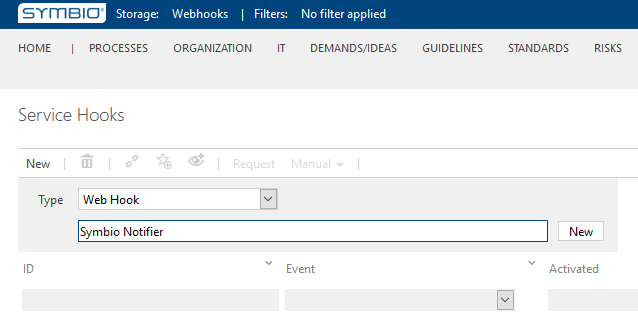
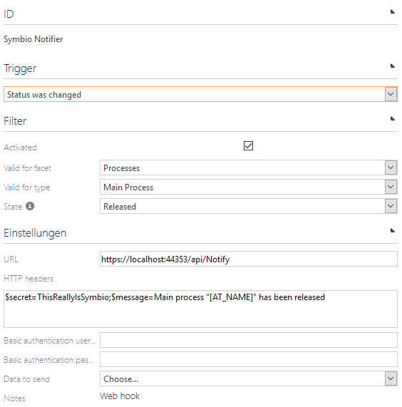
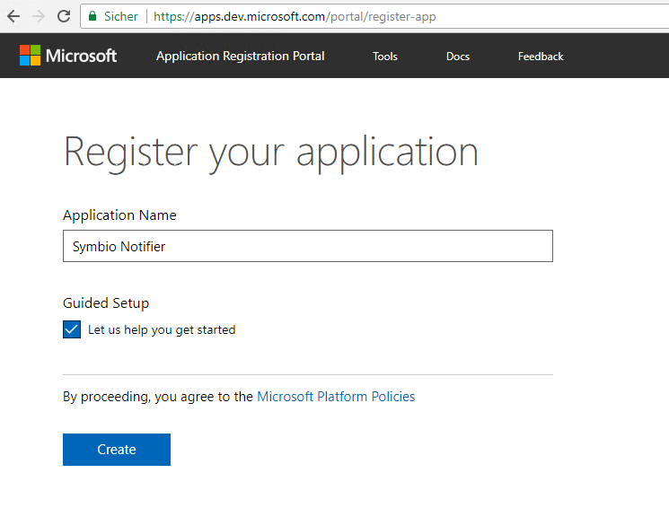
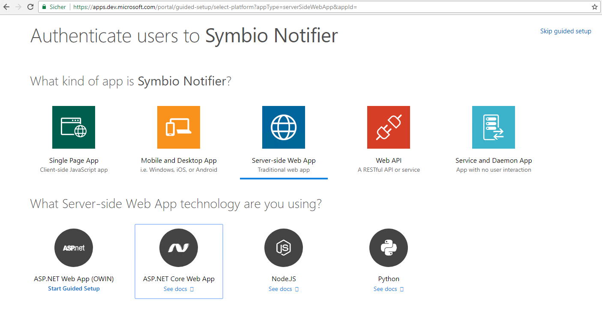
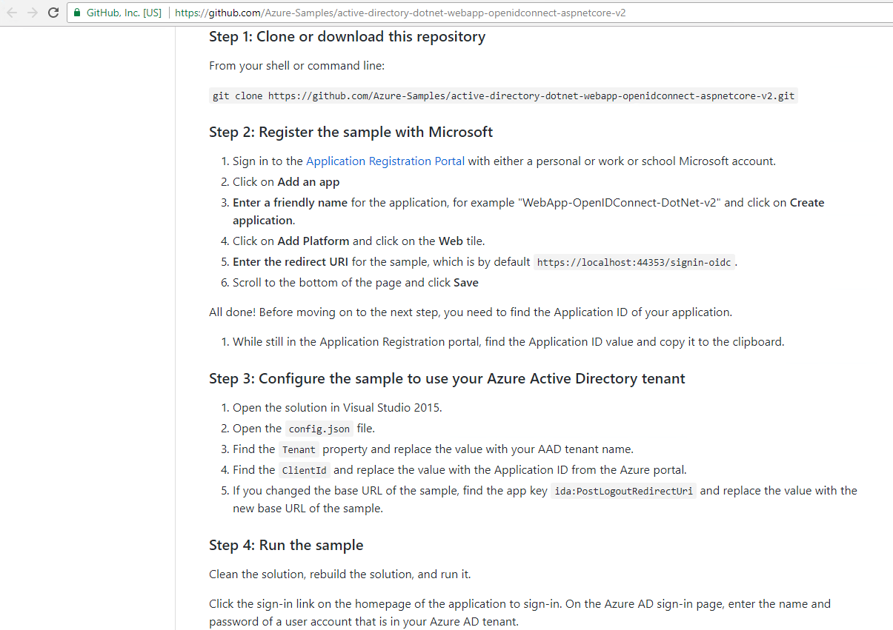
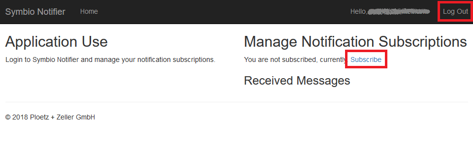

# webhook-symbio-notifier
This application showcases the implementation of a Symbio web hook consumer. It is based on https://github.com/Azure-Samples/active-directory-dotnet-webapp-openidconnect-aspnetcore-v2 which is Copyright (c) 2015 Microsoft Corporation and available under the MIT license.

---

# Symbio Service Hooks: Web Hooks - How To

## Configuring Web Hooks

1. Login to the Symbio Database for which you want to setup a Web Hook
2. Navigate to the "Admin Page" and select "Service Hooks" there

   `<Base URL>/<Collection>/<Database>/editor/1033/BasePlugin/Facet/Index/ServiceHooks.html#/list`

3. Select Type "Web Hook", enter a name of your choice, and click "New"

   

4. Configure your new Web Hook to your liking, don't forget to activate it when done

   

### HTTP Headers

Web Hook HTTP headers need to be defined in connection string format:
```
key1=value1;key2=value2;...
```
Beware of non-ASCII characters, control characters (CR, LF, ...), and reserved characters. See the HTTP specification, section Request Headers for details.

If you want to transfer complex data to your web hook endpoint, consider switching your Web Hook HTTP method to POST and configure an appropriate Post Body (in JSON format) to transfer that information.

### Configuring the example implementation

The sample application provided with this How To is named "Symbio Notifier". It is an ASP.NET Core web application which listens on `https://localhost:44353/api/Notify` for GET requests. To ensure that only Symbio notifies the web application a secret is provided in the Web Hook's HTTP header. In a true production environment transmission will be via SSL/TLS and the headers will be only visible to Symbio and Symbio Notifier. For this How To we keep the environment setup simple and use the default SSL certificate provided with IIS Express. You can see the Web Hook details for Symbio Notifier in the screenshots above.

## Consuming Web Hook Notifications

This section details how Web Hook notifications can be consumed. It follows the steps we took for the example implementation which uses Azure AD as an authentication provider. To register your app for authentication via Azure AD and get a base implementation follow these steps:

1. Register your app at https://apps.dev.microsoft.com/portal/register-app and select Guided Setup

   

2. Select the type of app you want to create (we have chosen "Web App/ASP.NET Core")

    

3. Clone the example repository linked from the app type selection and follow the steps provided there

   

4. Implement your selected endpoint by creating an appropriate ASP.NET Core (API) Controller

   We chose to name our API controller "NotifyController" and removed all methods except the `Get()` method from it.

## Implementing the Example

You can find the complete source code of the example application at https://github.com/ploetz-zeller/webhook-symbio-notifier.

### Expectations

* Upon release of a Main Process Symbio notifies us about that fact
* We provide a GET endpoint to receive that notification
* Users of our Azure AD can subscribe to those notifications
* Users can see the notifications they received during their subscription period
* Users can unsubscribe from future notifications
* Users can re-subscribe to future notifications

### Creating the Web Hook Endpoint

Our pre-defined endpoint is `https://localhost:44353/api/Notify`. To implement that endpoint create a new Web API controller "NotifyController" in the "Controllers" directory:

```csharp
namespace SymbioNotifier.Controllers
{
    [Route("api/[controller]")]
    public class NotifyController : Controller
    {
        private readonly INotificationService _notificationService;

        public NotifyController(INotificationService notificationService)
        {
            _notificationService = notificationService;
        }

        [HttpGet]
        public object Get()
        {
            if (Request.Headers["$secret"] == "ThisReallyIsSymbio")
            {
                var message = Request.Headers["$message"];

                _notificationService?.SendNotificationAsync(message);

                Response.StatusCode = 200; // OK
                return new { success = true };
            }

            Response.StatusCode = 401; // Unauthorized
            return new { success = false };
        }
    }
}
```

Note the `$secret` we check to ensure that only valid notifications get processed. The real processing is done by the "NotificationService" we will need to implement and register next.

### Further implementation details

#### Notification Service

Create a C# file "NotificationService.cs" in the folder "Services".

Add the service definition:

```csharp
namespace SymbioNotifier.Services
{
    public interface INotificationService
    {
        Task SendNotificationAsync(StringValues message);
        void Subscribe(ClaimsPrincipal user);
        void Unsubscribe(ClaimsPrincipal user);
        bool IsSubscribed(ClaimsPrincipal user);
        IEnumerable<string> GetCollectedMessages(ClaimsPrincipal user);
    }

    ...
}
```

Add the default implementation:

```csharp
namespace SymbioNotifier.Services
{
    ...

    public class DefaultNotificationService : INotificationService
    {
        private readonly IUserProfileService _userProfileService;

        public DefaultNotificationService(IUserProfileService userProfileService)
        {
            _userProfileService = userProfileService;
        }

        public Task SendNotificationAsync(StringValues message)
        {
            return Task.Run(() =>
            {
                foreach (var user in _userProfileService.AllUsers
                    .Where(u => u.IsSubscribed).ToList())
                {
                    user.CollectedMessages.Add(message);
                }
            });
        }

        void INotificationService.Subscribe(ClaimsPrincipal user)
        {
            var upn = GetUpn(user);
            var internalUser = _userProfileService?.GetUser(upn);
            if (internalUser != null)
                internalUser.IsSubscribed = true;

            _userProfileService?.SaveChanges();
        }

        public void Unsubscribe(ClaimsPrincipal user)
        {
            var upn = GetUpn(user);
            var internalUser = _userProfileService?.GetUser(upn);
            if (internalUser != null)
                internalUser.IsSubscribed = false;

            _userProfileService?.SaveChanges();
        }

        public bool IsSubscribed(ClaimsPrincipal user)
        {
            var upn = GetUpn(user);
            var internalUser = _userProfileService?.GetUser(upn);
            return internalUser?.IsSubscribed ?? false;
        }

        public IEnumerable<string> GetCollectedMessages(ClaimsPrincipal user)
        {
            var upn = GetUpn(user);
            var internalUser = _userProfileService?.GetUser(upn);
            return internalUser?.CollectedMessages ?? Enumerable.Empty<string>();
        }

        private string GetUpn(ClaimsPrincipal user)
        {
            return user?.Claims.FirstOrDefault(c =>
                c.Type == "http://schemas.xmlsoap.org/ws/2005/05/identity/claims/upn"
            )?.Value;
        }
    }
}
```

Note that we identify a user by his UPN (user principal name) which is unique within an instance of Azure AD and usually corresponds to the user's e-mail address.

The Notification Service delegates part of its work to the User Profile Service which will be implemented next.

#### User Profile Service

Create a C# file "UserProfileService.cs" in the folder "Services".

Add the service definition:

```csharp
namespace SymbioNotifier.Services
{
    public interface IUserProfileService
    {
        IEnumerable<User> AllUsers { get; }
        User GetUser(string upn);
        void SaveChanges();
    }

    ...
}
```

Add the in-memory (transient) implementation:

```csharp
namespace SymbioNotifier.Services
{
    ...

    public class MemoryUserProfileService : IUserProfileService
    {
        private readonly Dictionary<string, User> _users = new Dictionary<string, User>();

        public IEnumerable<User> AllUsers => _users.Values;

        public User GetUser(string upn)
        {
            if (!_users.ContainsKey(upn))
                _users[upn] = new User();

            return _users[upn];
        }

        public void SaveChanges()
        {
            // only needed in persisting services
        }
    }
}
```

#### Registering Services

Our two services need to be registered within "Startup":

```csharp
namespace SymbioNotifier
{
    public class Startup
    {
        ...

        public void ConfigureServices(IServiceCollection services)
        {
            ...

            // Add our own service.
            services.AddSingleton<IUserProfileService, MemoryUserProfileService>();
            services.AddTransient<INotificationService, DefaultNotificationService>();
        }

        ...
    }
}
```

#### Providing actions to Subscribe/Unsubscribe

Besides from UI adjustments we just need controller actions to subscribe/unsubscribe:

```csharp
namespace SymbioNotifier.Controllers
{
    public class HomeController : Controller
    {
        private readonly INotificationService _notificationService;

        public HomeController(INotificationService notificationService)
        {
            _notificationService = notificationService;
        }

        ...

        public IActionResult Subscribe()
        {
            _notificationService?.Subscribe(User);

            return RedirectToAction(nameof(Index));
        }

        public IActionResult Unsubscribe()
        {
            _notificationService?.Unsubscribe(User);

            return RedirectToAction(nameof(Index));
        }

        ...
    }
}
```

## Running the Example

You can run your application (e.g. in Visual Studio), login/logout using Azure AD, and subscribe/unsubscribe to Symbio notifications.



Remember that all notifications and subscriptions are lost when the process stops.
